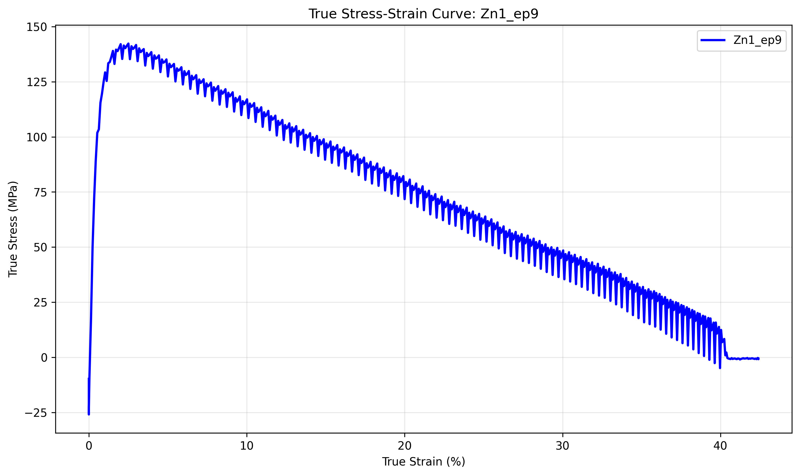

# Individual Sample Analysis: Zn1_ep9

## Sample Information
- **Sample Name:** ep9
- **Folder/Set:** Zn1
- **Filename:** ep9 _.1_1_400A_sr0.005_Tensile_05062024_201358.xls
- **Test Date:** 2025-07-02 23:50:32

## Processing Parameters
- **Current Applied:** Yes
- **Pulse On Time:** 0.1 s
- **Pulse Total Time:** 1.0 s
- **Amplitude:** 400 A
- **Strain Rate:** 0.005 s⁻¹
- **Temperature:** 1 °C

## Mechanical Properties (from Report Sheet)
- **Test Rate:** 0.1599999964237213 mm/s
- **0.2% Offset Yield Stress:** 0.0 MPa
- **Strain Hardening Exponent:** 0.0
- **Strain Hardening Coefficient:** 0.0
- **Elongation at Break:** 52.809

## Stress-Strain Data
- **Stress-Strain Data Available:** Yes

## AI Analysis

AI analysis skipped for faster processing. Enable AI analysis by setting skip_ai_analysis=False.

## Data Quality Assessment
- **Report Sheet Data:** ✓ Available
- **Stress-Strain Data:** ✓ Available

---
*Generated by Robust Tensile Data Analyzer on 2025-07-02 23:50:32*
