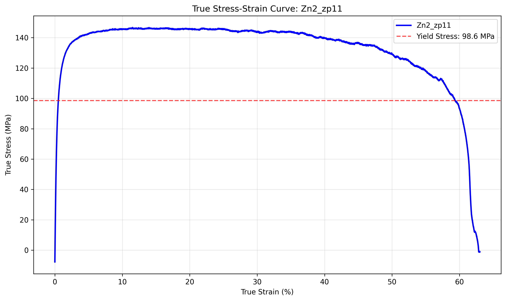

# Individual Sample Analysis: Zn2_zp11

## Sample Information
- **Sample Name:** zp11
- **Folder/Set:** Zn2
- **Filename:** zp11_0.01_0.1_100A_.001_Tensile_06062024_063205.xls
- **Test Date:** 2025-07-02 23:50:32

## Processing Parameters
- **Current Applied:** Yes
- **Pulse On Time:** 0.01 s
- **Pulse Total Time:** 0.1 s
- **Amplitude:** 100 A
- **Strain Rate:** N/A s⁻¹
- **Temperature:** 11 °C

## Mechanical Properties (from Report Sheet)
- **Test Rate:** 0.03200000151991844 mm/s
- **0.2% Offset Yield Stress:** 98.588 MPa
- **Strain Hardening Exponent:** 0.117
- **Strain Hardening Coefficient:** 212.199
- **Elongation at Break:** 87.788

## Stress-Strain Data
- **Stress-Strain Data Available:** Yes

## AI Analysis

AI analysis skipped for faster processing. Enable AI analysis by setting skip_ai_analysis=False.

## Data Quality Assessment
- **Report Sheet Data:** ✓ Available
- **Stress-Strain Data:** ✓ Available

---
*Generated by Robust Tensile Data Analyzer on 2025-07-02 23:50:32*
