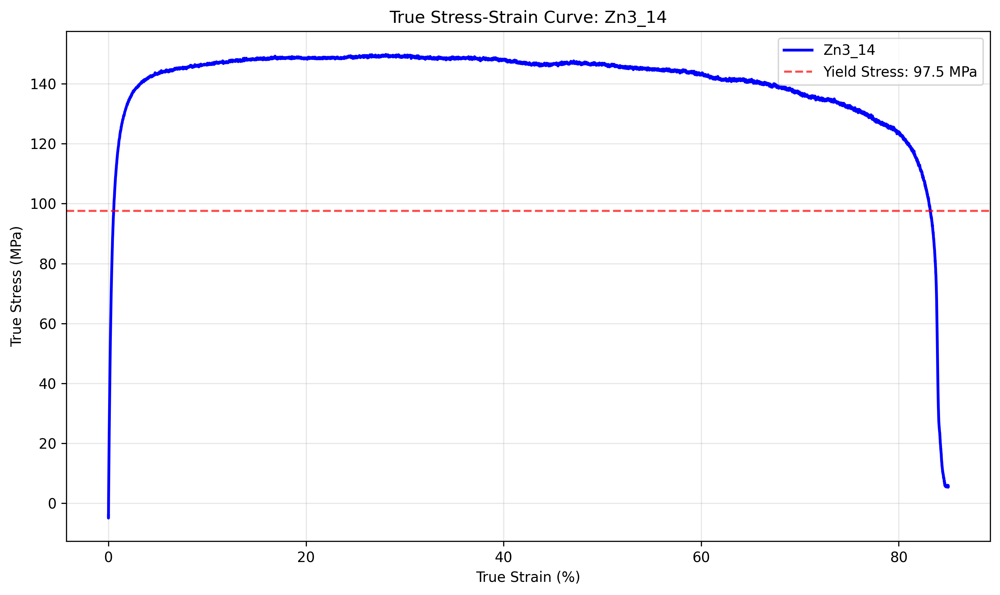

# Individual Sample Analysis: Zn3_14

## Sample Information
- **Sample Name:** 14
- **Folder/Set:** Zn3
- **Filename:** 14._Tensile_23042024_073500.xls
- **Test Date:** 2025-07-02 23:50:32

## Processing Parameters
- **Current Applied:** Yes
- **Pulse On Time:** N/A s
- **Pulse Total Time:** N/A s
- **Amplitude:** N/A A
- **Strain Rate:** N/A s⁻¹
- **Temperature:** 23042024 °C

## Mechanical Properties (from Report Sheet)
- **Test Rate:** 0.03200000151991844 mm/s
- **0.2% Offset Yield Stress:** N/A MPa
- **Strain Hardening Exponent:** N/A
- **Strain Hardening Coefficient:** N/A
- **Elongation at Break:** N/A

## Stress-Strain Data
- **Stress-Strain Data Available:** No

## AI Analysis

AI analysis skipped for faster processing. Enable AI analysis by setting skip_ai_analysis=False.

## Data Quality Assessment
- **Report Sheet Data:** ✓ Available
- **Stress-Strain Data:** ✗ Not Available

---
*Generated by Robust Tensile Data Analyzer on 2025-07-02 23:50:32*
