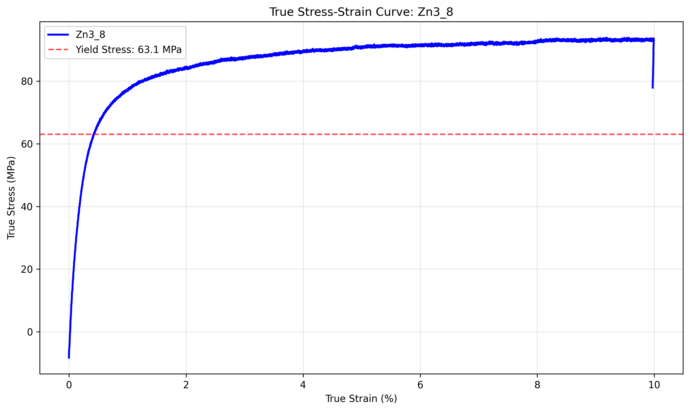

# Individual Sample Analysis: Zn3_8

## Sample Information
- **Sample Name:** 8
- **Folder/Set:** Zn3
- **Filename:** 8_Tensile_23042024_063329.xls
- **Test Date:** 2025-07-02 23:50:32

## Processing Parameters
- **Current Applied:** Yes
- **Pulse On Time:** N/A s
- **Pulse Total Time:** N/A s
- **Amplitude:** N/A A
- **Strain Rate:** N/A s⁻¹
- **Temperature:** 8 °C

## Mechanical Properties (from Report Sheet)
- **Test Rate:** 0.0031999999191612005 mm/s
- **0.2% Offset Yield Stress:** 63.062 MPa
- **Strain Hardening Exponent:** 0.101
- **Strain Hardening Coefficient:** 124.966
- **Elongation at Break:** 10.487

## Stress-Strain Data
- **Stress-Strain Data Available:** Yes

## AI Analysis

AI analysis skipped for faster processing. Enable AI analysis by setting skip_ai_analysis=False.

## Data Quality Assessment
- **Report Sheet Data:** ✓ Available
- **Stress-Strain Data:** ✓ Available

---
*Generated by Robust Tensile Data Analyzer on 2025-07-02 23:50:32*
